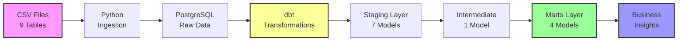

# 🚀 E-commerce Analytics Platform

> **Modern ELT Data Pipeline** | Transforming 100K+ orders into actionable business insights using dbt + PostgreSQL

[]()
[]()
[]()
[]()

---

## 📊 Project Overview

An **end-to-end analytics engineering project** demonstrating modern data transformation patterns, from raw CSV data to production-ready business intelligence models.

```
📦 Raw Data (100K orders) → 🔄 ELT Pipeline → 📈 Analytics Models → 💡 Business Insights
```

---

## 🏗️ Architecture



---

## 🎯 Key Achievements

### **Data Transformation Pipeline**

```
📥 Ingestion    →    🧹 Staging    →    🔗 Integration    →    📊 Analytics
   9 tables          7 models           1 joined view          4 marts
```

| Layer | Purpose | Models | Rows |
|-------|---------|--------|------|
| **Staging** | Data cleaning & standardization | 7 | Source data |
| **Intermediate** | Business logic & joins | 1 | ~100K orders |
| **Marts** | Analytics-ready insights | 4 | See below ⬇️ |

### **Production-Ready Marts**

| Mart | Focus | Rows | Business Value |
|------|-------|------|----------------|
| 🗓️ **Monthly Sales** | Time-series analysis | 24 months | Revenue trends & seasonality |
| 👥 **Customer Analytics** | Behavioral insights | 98,666 customers | Lifetime value & segmentation |
| 📦 **Product Performance** | Category analysis | 71 categories | Portfolio optimization |
| 🏆 **Individual Products** | Granular metrics | 32,951 products | Inventory management |

---

## 💻 Tech Stack

<table>
<tr>
<td width="33%" align="center">

<br/><b>PostgreSQL</b>
<br/>Data Warehouse
</td>
<td width="33%" align="center">

<br/><b>dbt</b>
<br/>Transformations
</td>
<td width="33%" align="center">

<br/><b>Python</b>
<br/>Ingestion & Analysis
</td>
</tr>
</table>

**Why these tools?**
- **PostgreSQL**: Production-grade, cost-effective, excellent analytics support
- **dbt**: Industry standard for SQL transformations, version control, testing
- **Python**: Flexible data processing, ready for ML/AI integration

---

## 📈 Business Impact

### Sample Insights Generated

```
💰 Revenue Analysis
   ├─ $1.26M from Health & Beauty (Top performer)
   ├─ 71 product categories analyzed
   └─ 24 months of trend data

👥 Customer Intelligence  
   ├─ 98,666 customers profiled
   ├─ Lifetime value calculated
   └─ Purchase patterns identified

📦 Product Strategy
   ├─ 32,951 products ranked
   ├─ Performance tiers assigned
   └─ Category optimization opportunities
```

---

## 🚀 Quick Start

```bash
# 1. Clone & Setup
git clone https://github.com/rahulramesh2602/ecom-analytics-platform
cd ecom-analytics-platform
python -m venv venv
source venv/bin/activate  # or `venv\Scripts\activate` on Windows
pip install -r requirements.txt

# 2. Database Setup
createdb ecommerce_db
python scripts/ingest_data.py

# 3. Run dbt Transformations
cd ecom_analytics
dbt run
dbt test

# 4. Explore Data
psql ecommerce_db -c "SELECT * FROM analytics.mart_product_performance LIMIT 5;"
```

---

## 📁 Project Structure

```
ecom-analytics-platform/
│
├── 📊 data/                    # Raw CSV files (9 datasets)
├── 🐍 scripts/                 # Python ingestion pipeline
│   └── ingest_data.py
│
├── 🔧 ecom_analytics/          # dbt project
│   ├── models/
│   │   ├── staging/           # 7 cleaning models
│   │   ├── intermediate/      # 1 joined view
│   │   └── marts/            # 4 analytics models
│   └── dbt_project.yml
│
├── 📋 requirements.txt
├── 📖 PROJECT_PLAN.md
└── 📘 README.md
```

---

## 🎓 What I Learned

<table>
<tr>
<td width="50%">

**Technical Skills**
- ✅ Modern ELT architecture
- ✅ dbt best practices (staging → marts)
- ✅ SQL optimization & window functions
- ✅ Data modeling patterns
- ✅ Git workflow & version control

</td>
<td width="50%">

**Business Skills**
- ✅ Translating data into insights
- ✅ KPI definition & tracking
- ✅ Customer analytics
- ✅ Product portfolio analysis
- ✅ Strategic recommendations

</td>
</tr>
</table>

---

## 🔮 Roadmap

### Phase 3: Industry Deep Dives (In Progress)
- [ ] Apparel category analysis
- [ ] Electronics pricing optimization
- [ ] Customer segmentation models

### Phase 4: Advanced Analytics
- [ ] Predictive modeling (customer churn)
- [ ] Recommendation engine
- [ ] Real-time analytics pipeline

### Phase 5: Production Scale
- [ ] Migrate to Snowflake/BigQuery
- [ ] Airflow orchestration
- [ ] Dashboard development (Metabase/Looker)

---

## 🎯 For Recruiters & Interviewers

**This project demonstrates:**

| Skill | Evidence |
|-------|----------|
| **Analytics Engineering** | 3-layer dbt architecture following industry best practices |
| **Data Modeling** | Dimensional modeling, fact/dimension tables, star schema |
| **SQL Mastery** | Complex joins, window functions, CTEs, aggregations |
| **Business Acumen** | KPI definition, insights generation, stakeholder communication |
| **Best Practices** | Git version control, documentation, modular code design |
| **Scalability Mindset** | Design patterns ready for production deployment |

**Key Differentiator:** Not just a technical exercise—demonstrates end-to-end thinking from raw data to business value, exactly what an Analytics Engineer does in production.

---

## 📫 Connect

**Rahul Ramesh**  
🔗 [LinkedIn](https://www.linkedin.com/in/rahulramesh2602/)  
💻 [GitHub](https://github.com/rahulramesh2602)  
📧 raramesh@tesla.com

---

<div align="center">

**Built with ❤️ for data-driven decision making**

⭐ Star this repo if you found it helpful!

</div>
